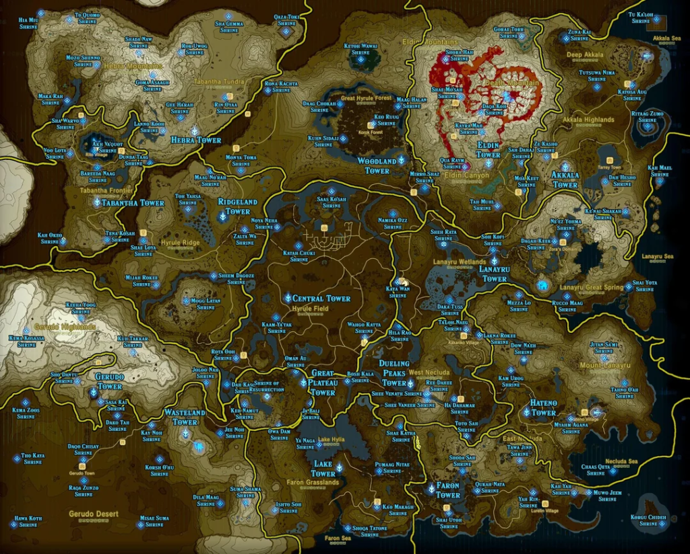

# A internet está ̶m̶o̶r̶r̶e̶n̶d̶o̶ virando outra coisa

A 'internet' está indo pelo ralo? Sim, pelo menos no formato que nós a conhecemos. Algo diferente vem por aí e eu estou ousando ter um pouco de otimismo.

- De tempos em tempos eu tenho vontade de fazer um vídeo sobre algo que eu estou sentindo e ainda não consegui desenvolver direito nas ideias e daí eu trago pra vocês pensarem junto
- Essa reflexão aqui é sobre onde eu acho que a 'internet' está indo. E vamos falar um pouco de onde ela veio.

- Entrar na internet hoje me lembra muito a ideia que eu tinha na cabeça quando li literatura cyberpunk como o Neuromancer por exemplo


- É meio irônico porque essa ficção foi escrita na década de 80 e influenciou a visão que tivemos da internet na década de 90 principalmente. "Navegamos na internet", "Um cowboy desbravando um espaço desconhecido", "A internet é uma vasta coleção de tubos por onde flue o conhecimento"
- Eu comecei a usar mesmo a internet no início dos anos 2000 e peguei o final do que a gente considera a 'web 1.0', pré blogs e pré redes sociais. E na real ela era relativamente vazia e pequena


- É tipo olhar para o mapa de um jogo antigo que parecia tão grande, mas que hoje é 1% do que se espera de um mapa de jogo open world. Mas os próximos anos iriam aumentar o nosso mapa:



- Mas mesmo esse mapa ali de cima é transponível e compreensível. A 'web 2.0' que é a web dos blogs e primeiras redes sociais era mais ou menos assim. A gente nunca imaginou que ia ter tanto conteúdo, até por que a gente cria ele também, mas ainda dava pra entender os limites desse espaço e conceitualizar ele na nossa cabeça
- Aí a gente chega na internet de hoje. A web 3.0 não é a rede da descentralização e dos tokens de crypto, embora ambos os campo tenham tentado cunhar o nome. A web que nós temos hoje é a da IAs generativas
- É um 'lugar' onde o conceito de algoritmo e personalização evoluiram a tal ponto que não existe mais um mapa para navegar ou uma conceitualização do espaço digital. Existe uma geração procedural do que a internet já foi no passado dentro de um labirinto, pra gente ficar correndo lá o dia inteiro

```
==================================================.
S |             |                     |         | |
| '==== .=====. |======== .========== | ==. .=. | |
|       |     | |   |     |   |       |   | | | | |
|=========. | | | | | | .=' | | .=====' .=' | | | |
|     |   | | |   | | | |   | | |       |   | |   |
| ==. | | | | '===| | | | ==| '=' .=====| .=' '== |
|   | | |   |     | | | |   |     |     | |       |
| | | | |=====. .=' | |==== |======== .=' | .=====|
| | |   | |   | |   | |     |         |   | | |   |
| | '===| | | | | .=| | .======== .===' .=' | | | |
| |   | |   | | | | |   |         |     |   |   | |
| '=. | | ==| | | | | ==' .====== | .===' .=| ==| |
|   | |     |   | |       |       | |     | |   | |
|== | |=========' | ======| ======' | .===' '== | |
|   | |       |   |   |   |   |     | |         | |
| .=' | .==== | ==| .=' | '===| ====' |=========' |
| |   | | |   |   | |   |     |   |   |   |       |
| | ==' | | ===== '=' .====== '== | ==' | | .==== |
| |       |           |           |     |   |     E
'==================================================
```

- E essa é a parte que é interessante: na web 2.0 quem construia isso tudo eram os próprios usuários e por um momento a gente viveu a euforia e os altos e baixos desse processo. Mas agora todo o nosso feed é algorítmico e as big techs estão convencidas de que esse é o futuro:
  - Ano passado já se estimava que 50% dos textos na internet são gerados por IA <https://futurism.com/artificial-intelligence/over-50-percent-internet-ai-slop>
  - Influenciadores fantasma da Meta <https://www.msn.com/en-in/money/other/meta-secures-patent-to-simulate-user-s-social-media-life-after-death-using-ai/ar-AA1X0HNi>
  - Músicos e atores de IA
  - Agentes em todos os lugares  

- E pra mim isso é cyberpunk pra caralho porque agora não estamos numa pequena comunidade cheia de casas e prédios que a gente pode visitar. Estamos presos dentro dos labirintos das mega corporações, desviando de robôs e tentando realizar nosso trabalho e viver nossas vidas pessoais enquanto somos super estimulados pro propagandas

{{#embed https://www.youtube.com/watch?v=YJg02ivYzSs }}

- Realmente somos os protagonistas de um conto cyberpunk. Hackers audaciosos e ferrados da cabeça navegando um mundo real/digital hostil. A dialética do high tech/low life do cyberpunk parece muito presciente agora
- Pra temperar um pouco ainda a ficção ultrarealista que é 2026 nós também temos bilionários investindo toda a sua grana num culto suicida à tecnologia. Pessoal do Dark MAGA, Effective Altruism, TESCREAL, novo futurismo e etc... Mais sobre isso em próximos vídeos

- Agora a parte que eu quero concluir e é o que eu tenho pensado muito. Tem um caminho, ainda meio obscuro que eu to enxergando.
- Eu tenho organizado grandes partes da minha vida num homelab, por exemplo: coleção de música, fotos pessoais, arquivos e etc...
- O que foi fascinante pra mim é como isso me fez ver sentido em atividades que eu fazia totalmente no automático. Por exemplo escutar música sem um algoritmo de recomendação, sem playlists, sem redes sociais. Apenas abrir a sua coleção e procurar algo que está ali disponível. Se eu quero algo diferente eu tenho que desbravar a internet e encontrar. Está sendo legal.
- E já que tem metáforas demais de jogos aqui já. Por que a internet convergiu pra algo asism tão sem sentido? Eu sempre lembro da minha experiência dissonante jogando alguns MMORPGs. São jogos que deveriam incentivar a exploração e uma grande gama de atividades, mas geralmente todos os estilos de jogo convergem para apenas o que é mais lucrativo / melhor aproveitamento de tempo.

  

- Fotos antigas, textos, programas de computador... vários artefatos feitos por mim ou por meus amigos, quando visualizados fora do contexto da internet generativa e infinita, tem significado novamente e não são apenas recombinações de bytes sem valor algum
- E isso é que era impresisonante da web 1.0, sem muita nostalgia porque não era um espaço realmente acessível, mas ela era 'vazia' de conteúdo só que cheia de relações humanas, sentidos e significados. E isso era em alguma escala compartilhado. Todos estávamos jogando no mesmo mapa
- A web 2.0 foi iterando sobre esse conceito com a personalização e o 'algoritmo', mas em algum momento cruzamos o limiar e descobrimos que cada um está numa internet diferente onde não existe quase nada compartilhado socialmente. Inclusive os momentos mais 'memoráveis' da internet nos últimos anos são quando vivemos eventos históricos ou memes juntos. Porém isso virou a exceção
- Isso é pra dizer que eu to prevendo um movimento pela descentralização da web começando a funcionar agora. Esse movimento não é de agora, ele vem desde a década de 2010 pelo menos. Mas ele estava prematuro, a web 3.0 não foi a vez dele.
- Porém agora que as IAs generativas dos **Corpos** estão engolindo toda a internet e transformando ela em slop cinza e sem personalidade faz cada vez mais sentido cortar o contato com essa velha internet e construir pequenas comunidades onde gostaríamos de interagir
- Tentem entender o que eu to dizendo. Não é uma questão de descentralizar por que é tecnicamente melhor, moralmente superior, mais privado ou mais alinhado com a idealização que tínhamos da internet.
- O problema é que a internet está morrendo e colapsando dentro de si mesma e esse movimento de fragmentação parece uma tendência pra mim. Pelo menos agora
- Outro dia a gente pode fazer um vídeo mais prático onde eu vou falar sobre os serviços que a gente tem nos homelabs, sobre os nossos projetos do Fediverso e discutir os bits e bytes

### Coisas pra ler:

* <https://www.eurogamer.net/from-aliens-to-cyberpunk-via-the-mass-effect-arc-syd-meads-artistic-legacy-lives-on-through-video-games>
* <https://github.com/awesome-selfhosted/awesome-selfhosted>
* <https://fediverse.party/>
* <https://blog.isacloud.im/>
