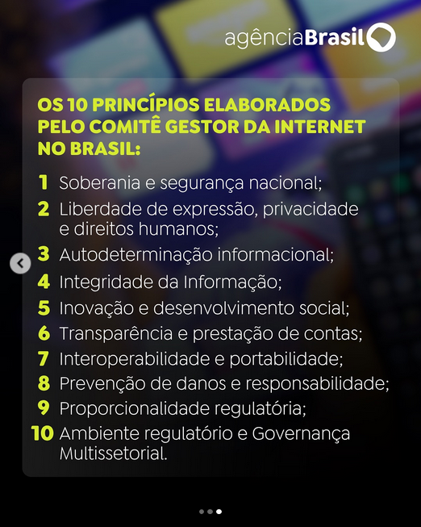

### Jornal 'A Verdade', Meta, Palestina e 2 opções para a regulamentação das redes

Jornal 'A Verdade', Meta, Palestina e 2 opções para a regulamentação das redes

<https://averdade.org.br/2025/06/censura-da-meta-suspende-pagina-do-jornal-a-verdade-no-instagram/>

> Em mais um ataque à imprensa dos trabalhadores, o monopólio  capitalista Meta, controlador do Instagram, tirou do ar a conta do  Jornal A Verdade. O ataque à liberdade de imprensa ocorreu na tarde  desta quinta-feira (05), com a suspensão da página, e foi consumado na  manhã deste dia 06 com o anúncio do banimento.
>
> A página do Jornal A Verdade no Instagram era uma das principais da  imprensa independente e de esquerda no Brasil. Com 100 mil seguidores, o  perfil reproduzia as matérias publicadas no jornal impresso, as  notícias do site, além de material exclusivo de audiovisual.
>
> Nossa página se destacou em coberturas de lutas importantes do povo  trabalhador, como a tentativa de despejo da Favela do Moinho, em São  Paulo, a luta contra as privatizações, as ocupações urbanas e contra a  fome organizadas pelo MLB, as greves de várias categorias e a luta dos  estudantes. Também somos uma voz ativa na denúncia contra o genocídio do  povo palestino.

#### A Meta e o genocídio Rohingya

<https://www.amnesty.org/en/latest/news/2022/09/myanmar-facebooks-systems-promoted-violence-against-rohingya-meta-owes-reparations-new-report/>

> Nos meses e anos anteriores à repressão, o Facebook em Mianmar havia se tornado uma câmara de eco de conteúdo anti-rohingya. Atores ligados ao exército de Mianmar e a grupos nacionalistas budistas radicais inundaram a plataforma com conteúdo antimuçulmano, publicando desinformação alegando que haveria uma iminente tomada de poder pelos muçulmanos e retratando os rohingya como "invasores".

#### A Meta e o genocídio Palestino

<https://www.hrw.org/report/2023/12/21/metas-broken-promises/systemic-censorship-palestine-content-instagram-and>

> A análise dos casos pela Human Rights Watch sugere quatro fatores subjacentes e sistêmicos que contribuíram para a censura:
>
> 1. Falhas nas políticas do Meta, principalmente em sua política de Organizações e Indivíduos Perigosos (DOI), que proíbe organizações ou indivíduos "que proclamam uma missão violenta ou estão envolvidos em violência" em suas plataformas. Compreensivelmente, a política proíbe a incitação à violência. No entanto, também contém proibições abrangentes de categorias vagas de discurso, como "elogio" e "apoio" a "organizações perigosas", cuja definição se baseia fortemente nas listas de organizações terroristas do governo dos Estados Unidos. A lista dos EUA inclui movimentos políticos com braços armados, como o Hamas e a Frente Popular para a Libertação da Palestina. A forma como o Meta aplica essa política efetivamente proíbe muitas postagens que endossam os principais movimentos políticos palestinos e reprime a discussão sobre Israel e Palestina;
> 2. Aplicação inconsistente e opaca das políticas do Meta, em particular no que diz respeito a exceções para conteúdo jornalístico, ou seja, conteúdo que o Meta permite que permaneça visível no interesse público, mesmo que viole suas políticas;
> 3. Aparente deferência aos pedidos de remoção de conteúdo por parte dos governos, como os pedidos da Unidade Cibernética de Israel e das unidades de referência da internet de outros países para remoção de conteúdo;
> 4. Forte dependência de ferramentas automatizadas de remoção de conteúdo para moderar ou traduzir conteúdo relacionado à Palestina.

#### A Meta coopera de perto com o exército de Israel

<https://www.donotpanic.news/p/metas-head-of-ai-policy-is-ex-idf>

### Regulamentação das redes

<https://dialogos.cgi.br/documentos/debate/regulacao-redes-sociais/>

<https://www.instagram.com/p/DKj7dDNsu6E/>

{{#embed https://www.youtube.com/watch?v=K7tNUM8FbMs }}

#### 2 opções para a regulamentação

- Regulamentação direta das redes: remoção de conteúdo, definição de regras, limites e transparência
- Criação de plataformas e "nichos" para as diferentes atividades na internet e limitação do poder das big techs
