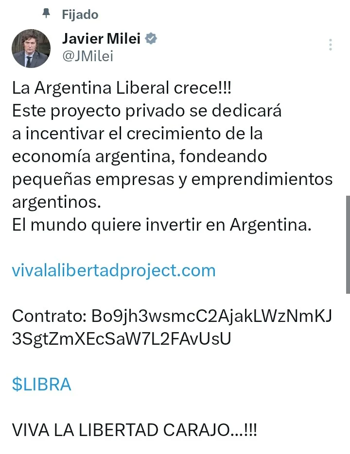
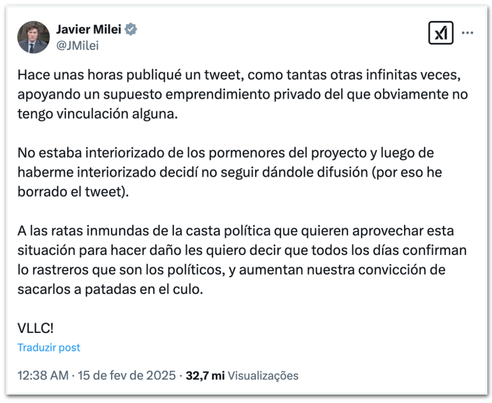
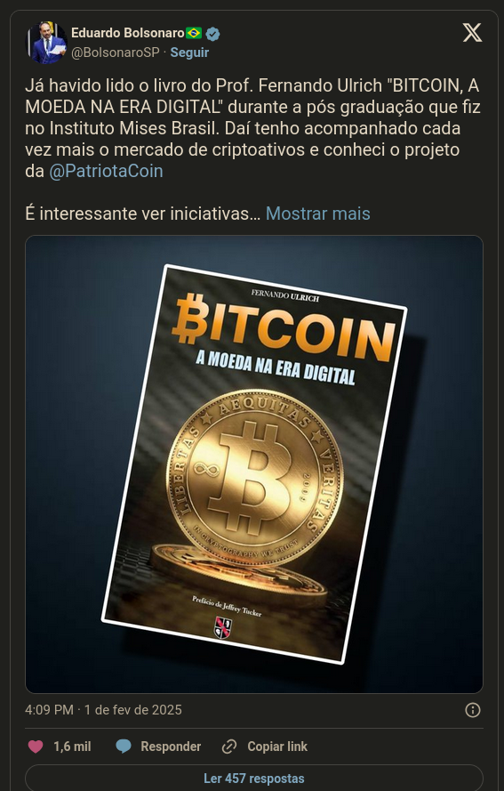

# O golpe de Cripto do Milei

- Como muitos outros antes dele, Javier Milei divulgou uma memecoin construída sobre a Solana que descambou num esquema de *pump 'n dump*
- Pesquisadores de blockchain relataram que aproximadamente $99 milhões em criptomoedas foram retirados do pool de liquidez do token $Libra, levando a uma investigação federal sobre o lançamento do token e o suposto envolvimento de Milei.

### Sequência de eventos:

Baseado em:

<https://en.wikipedia.org/wiki/%24Libra>

#### 14/02/25

* **18h58 (horário da Argentina):** A empresa panamenha KIP Protocol criou o token $Libra na plataforma Solana, como parte do projeto "Viva La Libertad".
* **19h01:** O presidente Javier Milei promoveu a criptomoeda $Libra em suas contas oficiais no Instagram, Twitter e Facebook, fornecendo o endereço do contrato para compra do token recém-lançado
* Após a publicação de Milei, o valor do $Libra disparou de $0,000001 para $5,20 em 40 minutos. Os fundadores, que detinham 70% do total de tokens, venderam suas participações quando o preço atingiu um pico, resultando em um colapso de 85% no valor da criptomoeda. Em poucas horas, aproximadamente $87 milhões foram retirados, afetando cerca de 74.000 investidores.

#### 15/02/25

* 00h38: Milei declarou que havia promovido a criptomoeda sem estar totalmente informado sobre os detalhes do projeto e decidiu deletar sua postagem após aprofundar-se no assunto.
* A KIP Protocol emitiu um comunicado distanciando-se da situação, afirmando que apenas forneceram a infraestrutura técnica, enquanto a Kelsier era responsável pelo projeto e sua execução.
* Hayden Davis, proprietário da Kelsier, afirmou ser assessor do governo argentino e que membros do governo haviam garantido apoio ao projeto. Ele criticou a decisão abrupta de deletar a postagem de apoio, alegando que os investidores do $Libra se sentiram traídos.
* Parlamentares da oposição anunciaram a intenção de iniciar processos de impeachment e apresentaram uma denúncia criminal contra Milei, acusando-o de violar os deveres de um funcionário público.

#### 16/02/25

* O governo solicitou que o Escritório Anticorrupção, parte do Poder Executivo, determinasse se houve conduta imprópria por parte do governo em relação ao evento. Além disso, foi criada uma nova unidade chamada "Unidade de Tarefas de Investigação" dentro da Presidência para investigar todo o projeto $Libra.

#### 17/02/25

* Um escritório de advocacia argentino operando nos Estados Unidos apresentou uma denúncia contra Milei e outros envolvidos ao Departamento de Justiça dos EUA e ao FBI.

#### Entrevista com Cofeezilla

{{#embed https://www.youtube.com/watch?v=EqizJTbxAEM}}

#### Impeachment e acusações posteriores?

<https://elpais.com/argentina/2025-02-19/el-escandalo-de-la-criptomoneda-libra-coloca-a-milei-ante-su-peor-crisis-en-mas-de-un-ano-de-gobierno.html>

# {{#embed https://www.youtube.com/watch?v=eRoOaZ-NXK0}}

### Isso é o novo normal?

- Trump, Melania, Dean Norris, Hawk Tuah e muitos outros já entraram na festa

- Lembram que Bolsonaro tinha sido "hackeado" e divulgado um golpe parecido há um tempo atrás?
- Mas como Eduardo Bolsonaro explica isso?

  

> Já a Patriota Coin, que atraiu mais de R$ 2 milhões em investimentos em suas primeiras 24 horas, hoje vale menos da metade desse valor. A volatilidade extrema das “memecoins” é conhecida no mercado, com casos como o da SQUID, baseada na série “Round 6” da Netflix, que caiu de US$ 2,8 mil para US$ 0,0007 em minutos.

<https://www.diariodocentrodomundo.com.br/eduardo-bolsonaro-divulgou-criptomoeda-nas-redes-antes-da-fraude-de-milei/>

Criptobros, criptosisters e criptonbs ... é imperativo que esse tipo de merda pare de acontecer se vocês querem que alguém leve as tecnologias de blockchain a sério.
