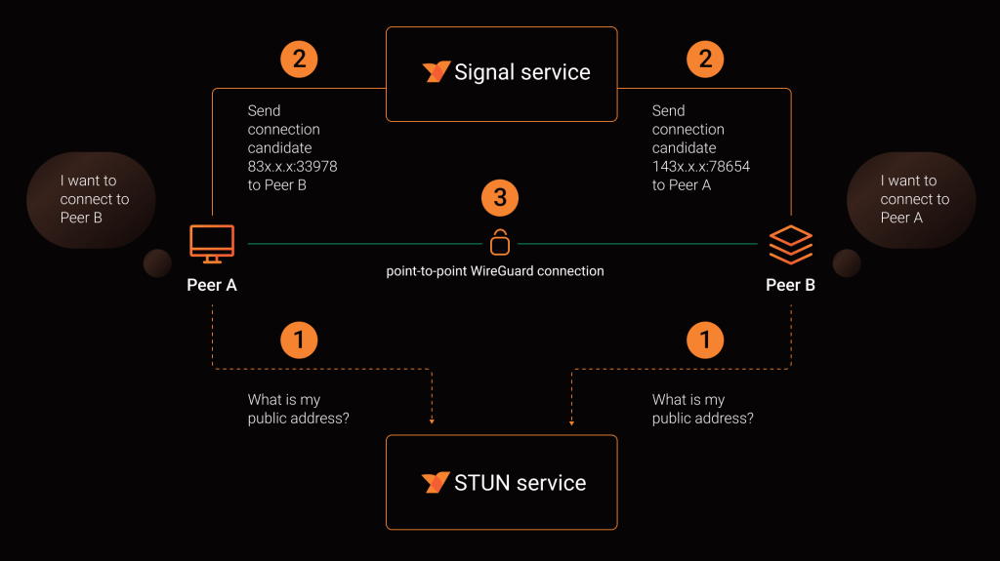
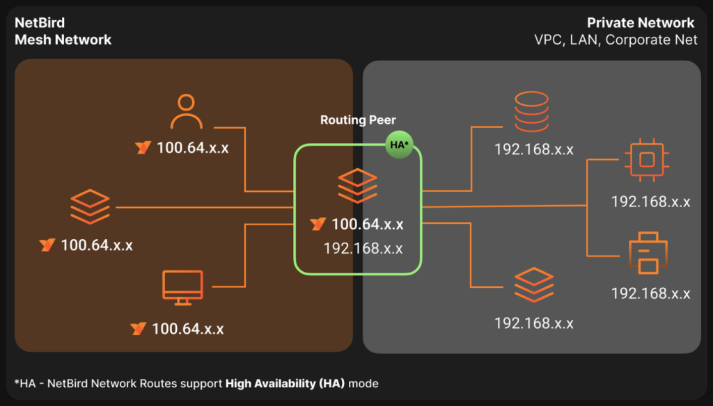

# Como e para quê usar Netbird?

Este é um tutorial introdutório sobre como usar Netbird para criar uma rede interna dos seus serviços, seja para homelab ou seja para o seu projeto pessoal ou a sua empresa. Como sempre a ideia é introduzir muitas ideias e mostrar um caminho para vocês se aprofundarem.

### O problema

- Nós gostaríamos de prover acesso a serviços de uma intranet a alguns dispositivos pré aprovados que estão fora dela

- Nós gostaríamos de criar uma topologia de rede que se comporta de maneira consistente mesmo na presença de diferentes redes internas, roteadores, firewalls, NAT e etc…

> “Eu tenho um serviço rodando dentro do meu homelab e quero acessar ele fora da minha rede local”
>
> OU
>
> “Eu tenho serviços de uma intranet que precisam ser expostos apenas para alguns dispositivos pré configurados”

- As soluções clássicas para esse problema são:
  - VPNs e túneis, port forwardings, ips externos

- Esse é o problema que o Netbird nos ajuda a resolver de uma maneira fácil e segura, usando o que tem de mais moderno no kernel do Linux.

[https://netbird.io/](https://netbird.io/ (preview))

### O que é o Netbird?

> O NetBird é uma plataforma de rede Zero Trust de código aberto que permite criar redes privadas seguras para sua organização ou residência. Projetamos o NetBird para ser simples e rápido, exigindo um esforço de configuração praticamente nulo e eliminando transtornos como a abertura de portas, regras complexas de firewall, gateways de VPN, entre outros.

#### Por que Netbird e não Tailscale? Por que não <insira outra solução aqui>?

- Não existe um motivo forte, eu estou recomendando a ferramenta que eu escolhi e que eu aprendi a usar.
  - Eu escolhi Netbird porque é possível auto hospedar o servidor de controle e dashboard e no Tailscale isso não parece tão simples
  - Mas é por isso que o tutorial na realidade vai ser mais alto nível.
  - Usem a ferramenta que resolve e tenham ideias para os seus próprios projetos

### Como funciona e como usar?

- O Netbird funciona instalando um cliente “peer” em cada máquina que desejamos adicionar à rede.

- Esses clientes podem ser registrados, configurados e autorizados por um serviço central com um dashboard bem completo.
  - É possível criar redes, sub redes, autorizar conexões, testar versão do sistema operacional, ver log de acessos… bem completo

- Eu recomendo muito ler a documentação do projeto e ir seguindo o passo a passo porque é muito bem escrito https://docs.netbird.io/

#### Adendo: self hosted VS o Netbird como serviço

- A parte mais difícil do rolê todo é hospedar o serviço de sinalização e controle que permite todos os nossos dispositivos se encontrarem usando a internet. Nós precisamos de pelo menos um servidor com IP externo, geralmente um VPS.

- É por isso que o Netbird oferece esse serviço pelo site deles, e no momento é o que eu uso:

[https://netbird.io/pricing](https://netbird.io/pricing (preview))

- É preciso entender que estamos trocando a conveniência por privacidade. E por isso também que ser um projeto aberto e com os componentes de servidor abertos me atrai. Estar hospedado na Europa e não nos EUA também é um ponto positivo

### Fazendo funcionar na prática:

- Agora que a gente entende o básico, fazer funcionar é questão de:
  - Instalar um peer nos dispositivos
  - Configurar uma rede entre os dispositivos
  - ???
  - Dispositivos veem uns aos outros

- Como expor serviços para a rede externa?

### Referências

{{#embed https://www.youtube.com/watch?v=62Tmt1THacs }}

<https://docs.netbird.io/>
