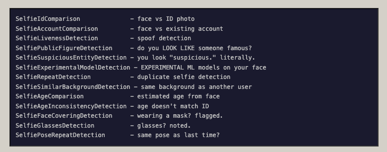

# OpenAI 🤝 Persona 🤝 governo dos EUA

Uma pesquisadora de segurança analisando o sistema de verificação facial da OpenAI descobriu muito mais do que esperava sobre a vigilância do governo dos EUA.

*Veja no canal:*

{{#embed  https://www.youtube.com/watch?v=botq8Xk3PbA }}

- Antes de começar o roteiro: a gente meio que já sabia esse tipo de coisa, mas isso aqui são provas e está desenhando a situação mais claramente

<https://www.malwarebytes.com/pt-br/blog/news/2026/02/age-verification-vendor-persona-left-frontend-exposed>

> Pesquisadores que investigam as verificações de idade do Discord afirmam ter descoberto  um front-end exposto pertencente à Persona, o fornecedor de verificação  de identidade utilizado pelo Discord. Isso revelou uma estrutura de  vigilância e inteligência financeira muito mais abrangente do que uma  simples ferramenta de “segurança para adolescentes”.
>
> ...
>
> Para analisar essas digitalizações, a Discord utiliza a startup de  verificação de identidade biométrica Persona Identities, Inc., uma  empresa que oferece soluções Know Your Customer (KYC) e Anti-Money  Laundering (AML) que se baseiam em verificações de identidade biométrica  para estimar a idade do usuário.
>
> ...
>
> Nesses arquivos, os pesquisadores encontraram detalhes sobre a  extensa vigilância que o software Persona realiza sobre seus usuários.  Além de verificar a idade deles, o software realiza 269 verificações  distintas, executa reconhecimento facial em relação a listas de  observação e pessoas politicamente expostas, filtra “mídia adversa” em  14 categorias (incluindo terrorismo e espionagem) e atribui pontuações  de risco e similaridade.
>
> A Persona coleta — e pode reter por até três anos — endereços IP,  impressões digitais de navegadores e dispositivos, números de  identificação governamentais, números de telefone, nomes, rostos, além  de uma série de análises de “selfies”, como detecção de entidades  suspeitas, detecção de repetição de poses e verificações de  inconsistência de idade.

<https://cybernews.com/privacy/persona-leak-exposes-global-surveillance-capabilities/>

- Leiam o relatório completo:

<https://vmfunc.re/blog/persona>

- Segundo a postagem, aqui estão alguns dos pontos que o serviço verifica para cada cadastro de foto:

- Outra evidência interessante encontrada é um endpoint de API da Persona com o mesmo nome de um sistema de vigilância contratado pela ICE:

> The researchers noticed that the subdomain “onyx.withpersona-gov.com”  bears the same name as ICE's $4.2 million AI surveillance tool ONYX,  though Song assured the resemblance is coincidental, and the name was  taken from a coworker's favorite Pokémon.

- Uma explicação desse sistema segundo a EFF:

> O ICE também firmou contratos com outras empresas de monitoramento de mídias sociais e análise de IA, como um contrato de US$ 4,2 milhões com a empresa Fivecast para a ferramenta de vigilância de mídias sociais e análise de IA ONYX. De acordo com a Fivecast, o ONYX pode realizar a “coleta automatizada, contínua e direcionada de dados multimídia” de todos os principais “fluxos de notícias, mecanismos de busca, mídias sociais, marketplaces, dark web, etc.”. O ONYX pode construir o que chama de “pegadas digitais” a partir de dados biográficos e conjuntos de dados selecionados que abrangem diversas plataformas, além de “rastrear mudanças de sentimento e emoção” e identificar o nível de risco associado a um indivíduo.

- Aqui tem um bom artigo sobre todos os aspectos da verificação da Persona:

<https://thelocalstack.eu/posts/linkedin-identity-verification-privacy/>

- Nos lembra do Cloud Act que permite que o governo dos EUA pegue qualquer dado de qualquer empresa dos EUA... **mesmo que esses dados estejam armazenados em outros países.**
  - Ouviu isso SERPRO? Eu não esqueci da parceria de vocês pra construção de infraestrutura """""soberana""""" com parcerias com empresas dos EUA

- E aqui tem um usuário da OpenAI em Junho de 2025 reclamando que agora é preciso usar escaneamento facial para poder acessar os planos com modelos mais avançados

<https://community.openai.com/t/openai-we-need-to-talk-about-org-verification/1284940>

- OpenAI argumenta que eles precisam proteger a sua tecnologia de ser 'apropriada' por competidores (vejam o vídeo da Deepseek aqui no canal). Mas descobriu uma coisa muito interessante na documentação da Persona:

<https://web.archive.org/web/20230207213023/https://docs.withpersona.com/reference/retrieve-a-government-id-verification>

- Mostrando que os clientes da empresa podem receber o cadastro do governo de cada 'ID de verificação' com uma chamada de API

### Por que escaneamento facial?

<https://proton.me/blog/facial-recognition-technology>

- É mais fácil de entender isso expondo as mentiras sobre quais dados são gerados por esse processo. Todas plataformas dizem uma versão de:

  > Seus dados são armazenados apenas durante a verificação e a plataforma só recebe a confirmação (ou a sua idade)

- Porém nossas fotos são transformadas em modelos de biometria facial, uma série de indicadores e flags e diversos formatos intermerdiários que são vinculados a nossos passaportes, redes sociais e etc...
- O escaneamento facial é uma maneira de resolver 'identificação na internet', um problema importante, ao mesmo tempo que alimenta uma indústria de vigilância em massa, treinamento de IA e repressão governamental.

### Mas é culpa do governo então?

- Sim, eu não entendo por que ainda tem gente burra que acha que "colunismos defender estado forte"

- O cerne da questão é que a internet, ou as 'redes sociais', como existem hoje são extremamente problemáticas e existe o clamor popular para solucionar esses problemas.
- Só que uma visão mais crítica das big techs mostra como fake news, abuso sexual, vícios, discurso de ódio em grande parte são dinâmicas incentivadas pelas plataformas e que alimentam o seu lucro
- A regulamentação focada simplesmente na responsabilidade individual das pessoas e fazendo isso por meio da agregação de dados pessoais e contratação dessas mesmas empresas é a armadilha perfeita
- Não mexe no modelo das big techs e cria um novo mercado de vigilância mais potente ainda.

### Conclusões e ações:

- Algumas pessoas podem dizer que não existe mais privacidade e que os nossos dados estão espalhados por vários bancos de dados. O objetivo é **não deixar mais fácil do que já é coletar e esquematizar esses dados**

- A lei do Brasil precisa exigir que plataformas que operam no Brasil usem um sistema de autenticação nacional e proibir o uso de plataformas de escaneamento facial atreladas aos EUA
  - Todas elas compartilham esses dados com parceiros e o governo e eu tenho certeza que isso fere LGPD e um monte de coisas mais
  - Vai juristas, nos ajudem!
- Pessoalmente buscar sair dessas plataformas, não interagir com elas e não realizar o escaneamento facial de forma nenhuma
- Ironicamente o 'big brother governo da China crédito social' hoje me dá acesso aos modelos da Deepseek de maneira aberta e mesmo pagando é só um cartão de crédito, tchau e bença. Pensem sobre isso.

### Referências extras

<https://www.salon.com/2026/02/20/big-tech-still-dreams-of-mass-surveillance-now-people-are-pushing-back/>

<https://www.eff.org/deeplinks/2026/01/ice-going-surveillance-shopping-spree>

<https://www.authoritarian-stack.info/>

#### Exemplos de como usuários tem burlado verificação facial

{{#embed https://www.youtube.com/watch?v=AOSFy_nmRPs }}

<https://sketchfab.com/tqyw/collections/human-face-08d97fa722cc41baa977fe4b16f825ae>
