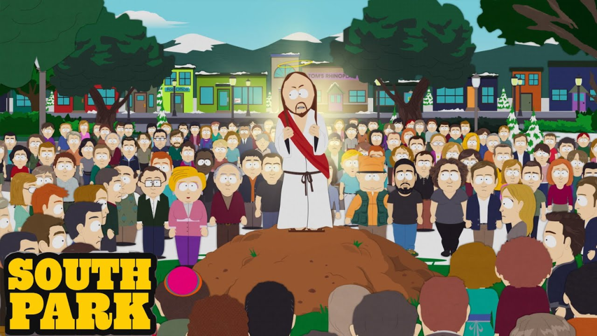

# Larry Ellison e o Controle da Mídia sob Trump

Larry Ellison - CEO da Oracle e aliado de Trump - agora é dono do TikTok nos EUA, da Paramount, da CBS e muito mais. Isso configura uma situação de consolidação da mídia sob o guarda chuva do governo dos EUA que não tem precedentes. Vamos conversar.

#### Não antropomorfize Larry Ellison

{{#embed https://www.youtube.com/watch?v=-zRN7XLCRhc&t=2306s }}

### O contrato do TikTok

- Lembram do banimento do TikTok? Pois é... o Trump resolveu

<https://www.infomoney.com.br/business/global/larry-ellison-um-magnata-da-midia-como-nenhum-outro/>

<https://apnews.com/article/trump-tiktok-china-d5d8a1d56b5185778536874d7fc1ee62>

### A dinastia "Ellison"

<https://www.bbc.com/portuguese/articles/cx2xjvw5p41o>

<https://www.cnnbrasil.com.br/economia/negocios/aos-81-anos-presidente-da-oracle-atinge-auge-de-influencia-e-poder/>

> Em uma entrevista de 2018 para Maria Bartiromo, da *Fox Business*, Ellison definiu sua posição política como parte do "centro desapaixonado. O entediante e desapaixonado centro", citando outros que ele considera centristas como Clinton, Rubio, senador Mitt Romney e o ex-primeiro-ministro britânico Tony Blair.

<https://www.bbc.com/news/articles/cr4qwwk0g0yo>

### South Park, Paramount e Trump (e muito mais)

<https://variety.com/2025/tv/news/south-park-paramount-plus-billion-dollar-deal-1236466524/>

<https://variety.com/2025/tv/news/skydance-colbert-late-show-anti-bribery-laws-paramount-senators-letter-1236476164/>

<https://g1.globo.com/pop-arte/tv-e-series/noticia/2025/09/18/cancelamento-de-jimmy-kimmel-revolta-artistas-nos-eua-veja-repercussao.ghtml>

<https://www.democracynow.org/2025/10/8/bari_weiss_david_klion_cbs_paramount>

### O buraco é muito mais embaixo

{{#embed https://www.youtube.com/watch?v=zp-o4BWz_XI }}

<https://www.cnnbrasil.com.br/internacional/tony-blair-elogia-plano-de-paz-de-trump-para-gaza-ousado-e-inteligente/>

<https://nucleo.jor.br/reportagem/2025-09-25-instituto-de-tony-blair-oracle-ia-brasil/>

#### Capitalismo de vigilância

<https://fortune.com/2025/09/28/larry-ellison-ai-surveillance-oracle-tiktok-deal-social-media/>
