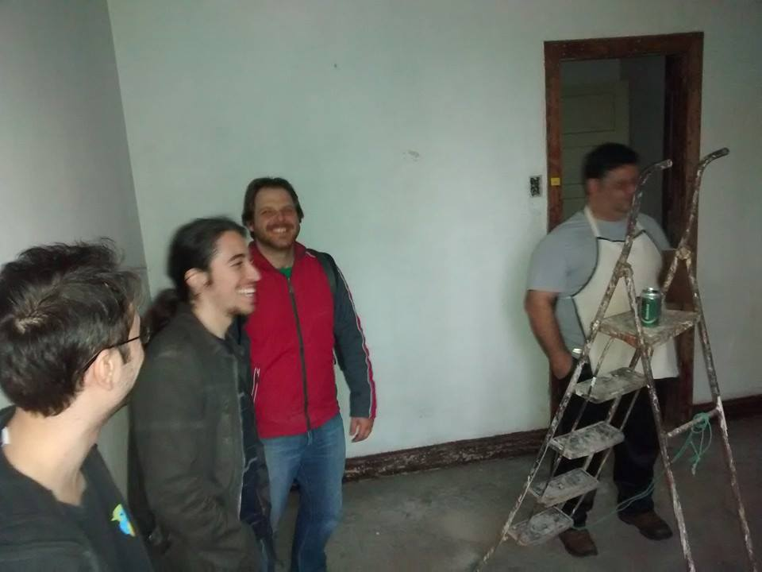
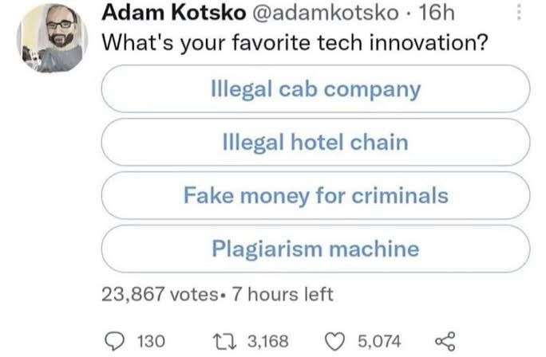
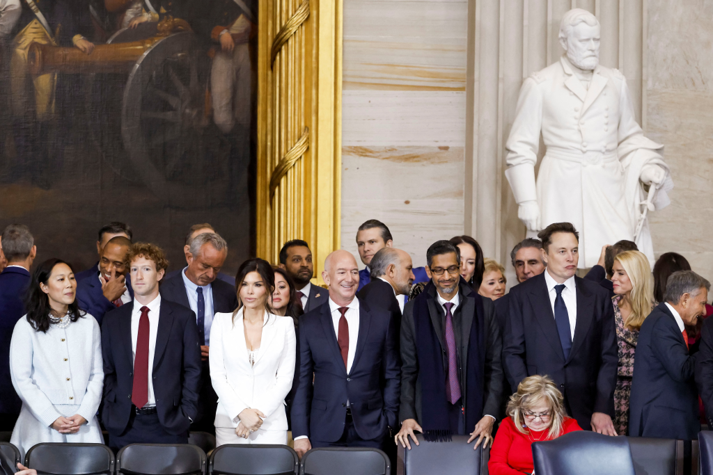

# Não estamos no cibersespaço. Estamos no Brasil.

**Só pra deixar claro, nós vamos gravar essa palestra. Se você for aparecer, falar ou qualquer coisa, por favor esteja ciente que precisa dar a sua permissão de uso de imagem e/ou nos peça pra te cortar da gravação.**

### Introdução

- Fala camaradinhas, o meu nome é Lucas Zawacki e eu sou um cientista da computação, programador, músico e militante
- Mas provavelmente muitos me conhecem por causa do canal TeClas

  {{#embed https://www.youtube.com/watch?v=MehfqW9lgYA}}

- Mas o que a gente fala no canal? **Tecnologia + Política DE CLASSES**
- Ou pra deixar mais explícito: o comunista da tecnologia

### Mas como a gente chegou aqui?

- Eu acho que essa é uma pergunta interessante... porque todo eu ouço:
  - O cara é comunista kkkkk?
  - Você não ia ter computador no comunismo kkkkk
  - É comunista e usa youtube kkkkkk ???
  - Comunista e está ganhando dinheiro kkkkkk

- Eu sempre fui uma pessoa muito incomodada com a maneira como o mundo é e naturalmente, eu queria fazer alguma coisa...

- Nesses meus 34 anos de vida eu já:
  - Me formei na faculdade
  - Fundei um hackerspace
  - Ajudei a organizar diversos eventos de tecnologia, software livre, culturais, hackthons e etc...
  - Integro o coletivo Soberana desde 2021

- Eu eu já tento criar conteúdo pra internet a uns 15 anos provavelmente ... mas hoje aqui estou
- E eu sinto que a minha evolução política foi uma jornada um pouco demorada e dolorosa (pra mim)
- Hoje o trabalho que eu faço na militância é uma continuação direta dessa evolução política.
  - Eu queria: politizar a área de TI
  - Eu tenho conseguido: trazer pessoas politizadas pra área de TI

- E por quê? Por que primariamente o canal faz uma crítica ao capitalismo

  ### E o que é o capitalismo?
- É a nossa maneira de viver, a maneira de produzir tudo que temos acesso
- E a tecnologia deixa isso bem claro:

  

  - Enshitification
  - Industria de jogos, jogos mobile
  - Vigilância
  - Centralização da Internet
  - Big Techs + Fascismo

- Mas até aí, isso é **anticapitalismo**. A gente que é da tecnologia temos alguns caminhos pra extravazar essa revolta que a gente sente. E geralmente a gente não vira comunista... vamos falar sobre

### Os movimentos são...

- Um movimento que sempre me fascinou foi o software livre
- E a evolução do movimento aqui no Brasil é fascinante e eu considero que vi ele crescer, florescer e "morrer" durante a minha vida de militância nele

  {{#embed https://www.youtube.com/watch?v=Auoe3XsWthM}}

- E hoje o movimento do software livre tem que lidar com um problemão, que sempre existiu: "**financiamento"**

- Outra coisa que me atraiu muito num momento foi **Cypherpunk** e não só ele, também outras drogas mais pesadas
  - **Timothy C. May** imaginou um mundo muito louco por causa da **criptoanarquia** que seria **inevitável**
  - **Phil Zimmermann** criou o PGP e foi perseguido pelo governo dos EUA por disseminar a criptografia
  - **Julian Assange** foi a face do Wikileaks e apostou que a livre disseminação da informação seria uma força positiva de mudança do mundo
- E como eu citei na descrição da palestra **Hal Finney** foi um grande desenvolvedor cypherpunk, primeiro usuário de Bitcoin
- Então, embora eu acredite que é inevitável que a sociedade toda seja revolucionada pela tecnologia, que todas as normas e maneiras de produzir se desmanchem no ar... tudo muda pra ficar igual
- E tem essa divisão que é muito comum na comunidade técnica, do técnico X político. Uma coisa que sempre me fascinou e incomodou:
  - "Cypherpunks write code"
  - "Code as law"
  - "Trust numbers, not people"
- Mas nós realmente confiamos em números e não nas pessoas?
  - 1990 e a Ideologia Californiana
  - Fetichismo da Tecnologia

{{#embed https://www.youtube.com/watch?v=-eev0Ysj6Qc}}

- E o **Hal Finney** deu a letra:

> \>In cyberspace, the default condition is that there is no interaction.
> \>Communication requires agreement by both parties. During this
> \>agreement, the laws (contracts, whatever) that the two parties
> \>follow can be communicated by each party to the other, and if
> \>party A does not feel that party B's laws provide him with
> \>enough protection from B, he can refuse contact until B agrees
> \>(at least for the duration of the communication) to more
> \>constraining laws. The cost of such a transaction will likely
> \>be negligible in cyberspace.
>
> The problem I have with this is that there is no such place as cyberspace.
> I am not in cyberspace now; I am in California.  I am governed by the
> laws of California and the United States even though I am communicating
> with another person, whether by postal mail or electronic mail, by
> telephone or TCP/IP connection.  What does it mean to speak of a govern-
> ment in cyberspace?  It is the government in physical space I fear.  Its
> agents carry physical guns which shoot real bullets.  Until I am able
> to live in my computer and eat electrons, I don't see the relevance of
> cyberspace.

#### E daí a gente volta atrás...

- Hoje todo mundo usa software livre? Por que não?
- Como a **criptoanarquia** reduziu o poder 'do estado'? Como as big techs se relacionam com o estado? Aonde estão os cypherpunks?
- Então pra mim é natural que se você tem um cérebro que sente empatia você vira anticapitalista, mas até aí vários movimentos são anticapitalistas e isso não necessariamente gera uma mudança no mundo
- Anticapitalismo não é pra ser um estilo de vida, uma escolha, da mesma maneira que depois que a gente descobre que tem um câncer a gente não escolhe fingir que **NÃO ESTÁ** com câncer
- Mas no capitalismo a gente sente uma grande alienação, a gente tem nossas identidades que falam apenas entre si

- Então acaba sendo mais fácil e cômodo a gente "se esforçar" para trabalhar no que a gente quer, no que a gente é 'bom'

  ::: success
  Eu vou fazer um software que resolve X problema!

  :::
- Por exemplo, como Mark Fischer nos pergunta: **e se a gente fizesse um protesto que todo mundo quisesse participar?**

  ::: error
  **E se eu criasse um software que resolvesse o capitalismo?**

  :::
- Aí eu trago de volta o comunismo. A gente não é comunista porque a gente sabe que o **mundo está com câncer** e quer se sentir superior aos outros. A missão do comunista é **mudar o mundo**
- Então a resposta pra pergunta do **Mark Fischer**, que eu remixei um pouco. O que iríamos fazer? Fazer de tudo pra **superar** o capitalismo

### Mas o que fazer?

- Por que sabe quando as pessoas dizem assim:
  - Vocês são muito radicais, não é melhor pegar o que existe de bom no capitalismo e no socialismo e criar uma coisa nova?
- Parabéns camaradas, vocês escreveram o manifesto comunista

- O comunismo/socialismo/marxismo é isso: uma crítica do capitalismo e **PRÁTICA PARA SUPERÁ-LO**

- Então sabe aquela discussão entre estudar VS botar em prática? Na realidade é os dois, reptidas vezes... a **práxis** tava aqui o tempo todo, só você não viu.
- E por incrível que pareça eu aprendo isso de novo e de novo, todo dia fazendo militância com meus camaradas da Soberana e criando conteúdo no canal.

- Mas, como chegar la? Sabe aquele LENINISMO que a gente fica repetindo pra vocês? É que o homi era brabo e ele escreveu uma coisinha chamada 'Que Fazer?' já faz um tempo

Ouça na audioteca crítica: <https://audioteca-critica.vercel.app/>

- E esse livro não é um guia, ele é o exercício diário de **PRÁXIS** que a gente precisa para trabalhar em agitação e propaganda, na profissionalização do nosso trabalho e da nossa comunicação revolucionária
- Quanto mais a gente milita, conversa com as pessoas, toca tarefas e estuda, mais fica claro que a gente precisa escrever o nosso 'Que Fazer?'
- E é por isso camaradinhas que eu sou comunista e marxista leninista.
- Por que eu quero escrever código, eu quero construir software e tudo mais. Porém o que a gente quer acima de tudo é MUDAR O MUNDO e o mundo roda o nosso código e não o contrário

  # É por que nós estamos no Brasil e não no ciberespaço

Vlw 🙂
