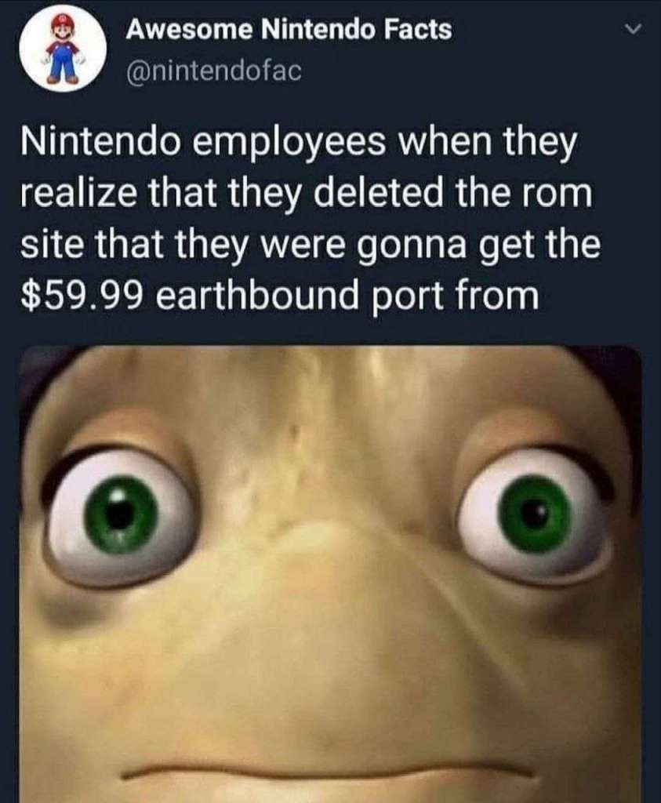

# Empresas contra a preservação da cultura

O grande inimigo da preservação digital é o capitalismo. Se nós tivermos acesso livre à cultura do presente e do passado fica mais difícil de aceitar o trabalho medíocre e mercadológico do futuro.

## O Arquivo da Internet ainda está sob ataque

**Batalha judicial entre Internet Archive e gravadoras termina em acordo:**  a disputa envolvia o Great 78 Project, que busca preservar 3 milhões de  gravações musicais antigas registradas em frágeis discos de goma-laca, a  fim de auxiliar historiadores na documentação da história fonográfica.  Gravadoras como UMG Recordings, Capitol Records e Sony Music  Entertainment alegaram perdas de até 700 milhões de dólares com o  projeto. Os termos do acordo ainda não foram divulgados. Também é  improvável que o valor final seja tornado público. As informações são do  site Ars Technica.

<https://arstechnica.com/tech-policy/2025/09/internet-archives-big-battle-with-music-publishers-ends-in-settlement/>

#### Anteriormente em Canal TeClas...

{{#embed https://www.youtube.com/watch?v=qbxqbwAICK0 }}

<https://rapzilla.com/2024-12-existential-threat-facing-soul-internet/>

<https://www.fightforthefuture.org/actions/demand-big-record-labels-drop-their-suit-to-destroy-the-internet-archive/>

#### A luta das empresas contra a preservação digital é engraçada

<https://www.reddit.com/r/emulation/comments/9as2ii/did_nintendo_actually_download_roms_for_their/>

<https://techcrunch.com/2011/03/16/ubisoft-caught-using-pirated-material-in-pc-version-of-assassins-creed-brotherhood/>

#### E a tecnologia pode ser muito legal...

<https://radio.garden/>

<https://everynoise.com>

### ...porém

{{#embed https://www.youtube.com/watch?v=cT8TpwEeWSQ }}
