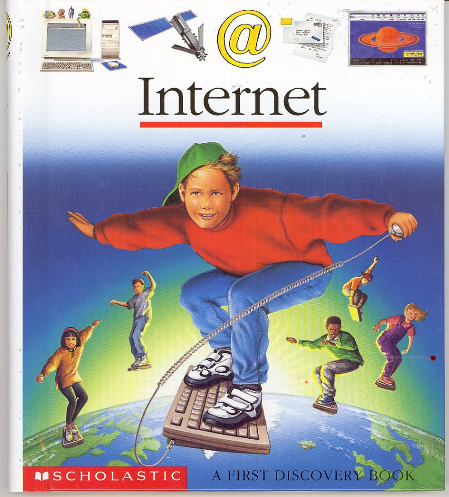

# Soberania Digital: Uma perspectiva brasileira

O que é soberania? Faz sentido falar de soberania digital?

{{#embed https://www.youtube.com/watch?v=oreTIGSDLHM }}

- O ~~governo~~ **povo** que tem **soberania** pode definir as leis no seu território. Muito relacionado com os conceitos de autodeterminação e autonomia

- Daí já vamos começar com uma pergunta: a tecnologia é boa ou ruim? Ela é neutra?
- Tem várias maneiras de pensar nisso, porém o mais importante aqui é pensar no que acontece quando "pulamos" esse debate
  - Divisão entre político e técnico
  - Transformação digital, inovação, modernização, etc...
  - **Code as law**

- Se nos propromos a ter essa discussão nós chegamos à conclusão óbvia. Decisões políticas são feitas quando fazemos decisões "meramente técnicas"
- **"Quem realmente controla a tecnologia que usamos nos nossos dispositivos? Quem tem nossos dados?"**

### Uma leve digressão: a internet/ciberespaço é um "lugar"?

### **O Conceito de Soberania Digital**

- Controle autônomo de infraestrutura, dados e tecnologias por um povo
  - **1**ᵃ **definição**: ligada a autonomia e segurança as infraestruturas informacionais, infraestruturas de dados em economias “dataficadas”, necessidade que o estado garanta a segurança digital da população para com conflitos politicos e econômicos externos
  - **2**ᵃ **definição:** ligado ao desenvolvimento econômico local - extraçao de valor dos dados do país matriz ou país alvo e processamento para o país a qual pertence a big tech (países imperialistas via de regra) para minar o desenvolvimento tecnológico em países muitas vezes da periferia do capitalismo
  - **3**ᵃ **definição:** autodeterminação do indivíduo ou de uma população sobre os dados que produz ou que são produzidos sobre si mesmo
- Pergunta: conseguimos pensar em exemplos de países que possuem soberania digital? Será que EUA, Alemanha, Brasil, Japão, França, Rússia, China tem soberania digital?

### **Uma Visão Critica**

- A tecnologia é uma força produtiva. Qual a sua relação com o modo de produção? Com a maneira como construímos a nossa sociedade?
- A tecnologia não só automatiza processos, ela modifica e desloca os processos para outras esferas

> "... os territórios nacionais se transformam num espaço nacional da economia internacional e os sistemas de engenharia mais modernos, criados em cada país, são mais bem utilizados por firmas transnacionais que pela própria sociedade nacional." - Milton Santos, A natureza do espaço: técnica e tempo, razão e emoção (São Paulo, Edusp, 2002).
>
> <https://outraspalavras.net/outrosquinhentos/para-hackear-o-colonialismo-e-o-racismo-digital/>

- Qual o papel de trabalhadores de tecnologia nesse processo? Servidores de TI, programadores, engenheiros de software, profissionais da comunicação, etc...
- Como os países centrais (ditos ricos) e suas grandes corporações moldam a infraestrutura tecnológica global?
  - Ataques à privacidade, vigilância digital
  - Imposição de modelos de negócio
  - Termos de uso e padrões tecnológicos que favorecem os interesses dos seus próprios países
  - Perpetuação das relações de subordinação e desigualdes

### **Obstáculos ao Desenvolvimento Tecnológico Nacional**

- O desmantelamento de empresas públicas de tecnologia, como a PROCERGS e a PROCEMPA.
  - Não é um acidente. É sintoma de uma lógica que prioriza o corte imediato de gastos em nome de um suposto "equilíbrio fiscal", enquanto transfere riqueza e controle para conglomerados que se utilizam de nossos dados
  - Arcabouço Fiscal
  - Conciliação com as big techs (**Redata e os data centers**)
- Se o código é a lei à qual estamos sujeito 'de facto', então não temos controle sobre as leis do nosso território
- Enfraquecimento dos sindicatos e das pautas da classe trabalhadora, aumento da PJtoziação e balcanização da classe
- A privatização do conhecimento e a luta pela tecnologia como bem comum.

**Dependência Tecnológica e Neocolonialismo Digital**

- Dependência de servidores, serviços e softwares proprietários.
- Existe uma relação entre o colonialismo histórico e a atual exploração digital
  - Quando realizamos, por exemplo, uma venda aqui no Brasil por meio da tecnologia de uma big tech - e.g. WhatsApp - é como se um aspecto da nossa economia local gerasse lucro para uma empresa estrangeira. Repetindo, big techs usam a nossa infraestrutura comunicacional para expandir os mercados de seus produtos.
  - Acumulação primitiva de dados
  - Dominação digital, ciberguerra
- Onde está o investimento na melhoria das condições locais de trabalho e na infraestrutura tecnológica nacional que as big techs fazem no Brasil?
  - A dependência tecnológica é uma espécie de privatização desses espaços virtuais com pouca ou nenhuma contrapartida

### **Caminhos para a Soberania Digital**

- Software livre e código aberto como instrumentos de emancipação. É importante pensar: que tipo de movimento de software livre
- Políticas públicas para fomentar tecnologias nacionais e independentes e focadas num planejamento estratégico de desenvolvimento nacional
- Cooperativismo digital e alternativas descentralizadas
- Como servidores e profissionais de TI podem atuar na luta pela soberania digital dentro e fora de seus ambientes (indicações de livros?)

### **Conclusão**

- A Luta pela Soberania Digital é um dos aspectos maiores na libertação da nossa nação.
- Perguntas e debate?
