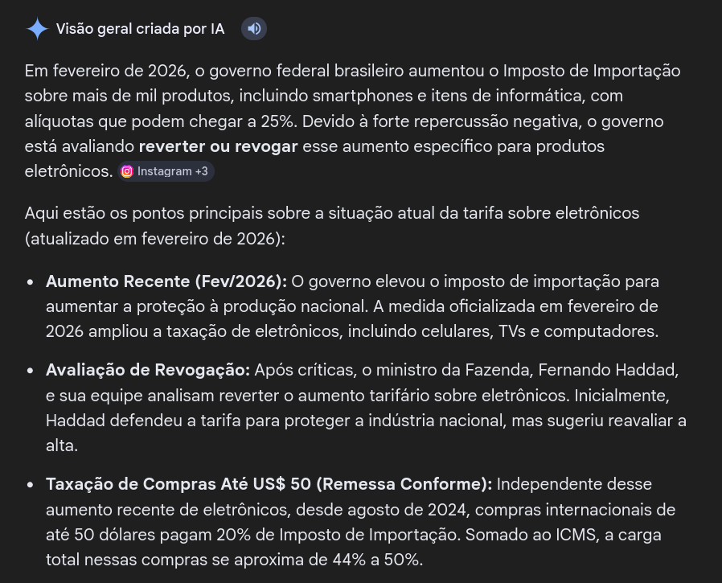

# A tarifação dos produtos eletrônicos em Fev/2026

Uma resolução do GECEX em Fevereiro de 2026 aumenta as tarifas de mais de 1000 produtos, muitos deles aparelhos e componentes eletrônicos, e isso causou um caos nas redes sociais. Vamos falar sobre.

- Vamos dividir esse vídeo em 3 momentos:
  - A real mudança das alíquotas, ou seja, entender o que mudou e como isso irá (iria?) nos afetar
  - O motivo porque essa medida foi tomada
  - A repercussão, principalmente nas redes, dessa decisão

- Vamos começar com algumas manchetes e trechos dessas reportagens para tentar entender a situação

<https://istoedinheiro.com.br/haddad-aumento-de-imposto-de-importacao-de-mais-de-mil-produtos>

> O ministro da Fazenda, Fernando Haddad, afirmou nesta quarta-feira, 25, que o aumento das alíquotas do imposto de importação de uma lista ampla de eletrônicos tem objetivo puramente regulatório, não gera impacto nos preços desses equipamentos e busca “proteger a produção nacional”.
>
> No início de fevereiro, o Comitê Executivo de Gestão da Câmara de Comércio Exterior (Gecex/Camex) aumentou as alíquotas do imposto de importação de mil itens. Além de smartphones, freezers e painéis com LED, a alta do imposto alcança máquinas e equipamentos como caldeiras, geradores, turbinas, fornos industriais, robôs industriais, empilhadeiras, tratores, plataformas de perfuração, navios, aparelhos de ressonância magnética, tomógrafos e equipamentos laboratoriais.
>
> O reajuste pode elevar as tarifas em até 7,2 pontos percentuais, atingindo setores que dependem de compras internacionais. Parte dos novos percentuais já entrou em vigor; o restante passa a valer a partir de março.

<https://veja.abril.com.br/economia/governo-eleva-em-ate-25-o-imposto-de-importacao-sobre-mais-de-mil-produtos/>

<https://www.adrenaline.com.br/em-alta/brasil-eleva-imposto-de-importacao-de-eletronicos-incluindo-smartphones/>

[https://www.diariodocentrodomundo.com.br/apos-reacao-nas-redes-governo-avalia-revogar-tarifa-sobre-eletronicos-importados/](https://www.diariodocentrodomundo.com.br/apos-reacao-nas-redes-governo-avalia-revogar-tarifa-sobre-eletronicos-importados/#:~:text=Ap%C3%B3s%20rea%C3%A7%C3%A3o%20nas%20redes%2C%20governo%20avalia%20revogar%20tarifa%20sobre%20eletr%C3%B4nicos%20importados)

**Resolução do GECEX de 04/02/26** <https://static.poder360.com.br/2026/02/RESOLUCAO-GECEX-No-852-DE-4-DE-FEVEREIRO-DE-2026-RESOLUCAO-GECEX-No-852-DE-4-DE-FEVEREIRO-DE-2026-DOU-Imprensa-Nacional.pdf>

<https://www.in.gov.br/web/dou/-/resolucao-gecex-n-852-de-4-de-fevereiro-de-2026-685397607>

- Agora pra tentar entender efeito, por exemplo para o consumidor que quer um desktop novo, o que seria necessário é:
  - Consultar o NCM de cada componente a ser comprado
  - Comparar as novas alíquotas efetivas com as alíquotas anteriores e entender o aumento (16% -> 20% por ex.)
  - Levar em conta outros fatores como exceções tarifárias ou taxação de componentes intermediários ou bens de capital que podem modificar o preço final

- Não é surpresa que é uma questão extremamente confusa, fácil de usar para atacar o governo e que no geral só "cheira mal"

- Queria recomendar essa thread no Reddit (quantas vezes ouviram essa frase?) que fez um bom trabalho de resumir a situação e tem uma discussão surpreendentemente boa:

<https://www.reddit.com/r/computadores/comments/1rf8lu1/a_modera%C3%A7%C3%A3o_deveria_fixar_post_com_informa%C3%A7%C3%A3o/>

- Inclusive muita gente discute o caso dos smartphones que tiveram um aumento de 4 pontos percentuais (16% para 20% o que poderia ser visto como uma "aumento de 25%" mas isso seria confuso né?)
  - 95% dos comprados no Brasil não seriam afetados pois são montados aqui
  - Porém uma das marcas afetadas seria a Xiaomi por vir importada da China (exemplo com um celular que custa 1000 reais)

- Qual o motivo dessa mudança nas alíquotas?
  - A proteção dos interesses de uma burguesia industrial da economia (vs um setor importador ou uma classe média que usa componentes como instrumento de trabalho)
  - Manter as metas de superávit e não furar a meta fiscal do governo achando algumas arrecadações
  - É uma tentativa de fazer política fiscal e política industrial que, na minha opinião o Haddad achou que ia ser de boa, MAS...

- ..vamos falar sobre repercussão nas redes. Obviamente Nikolas Ferreira decidiu sar do Xwitter, botar a camisetinha preta, entrar na sala preta e tacar lhe pau no governo.

<https://revistaforum.com.br/politica/tarifas-nikolas-desinformacao/>

- Uma busca com 'tarifa sobre eletrônicos' mostra:

- A bolha de influenciadores de informática repercutiu isso muito pesadamente como um aumento de impostos que vai ajudar a inviabilizar a compra de computadores pela classe média?
- Eles não estão errados, afinal eu também fiz vídeo sobre preço de RAM e de GPU certo? Sim, eu não posso tirar a razão:
  - Porém no caso da RAM nos últimos 2 anos temos um aumento de quase 4x em alguns produtos o que é bem diferente do pior caso com essa taxação que seria 25%
  - É a diferença de 100x4 (400) e 100x0.25 (125)

- O próprio Haddad explicou que a queda do dólar nos últimos tempos vai ajudar a compensar essas tarifas balanceando diversos preços no 'mesmo lugar'...
- ...porém a gente sabe como o próprio pânico em cima dessas medidas provê uma boa justificativa para vendedores aumentarem seus preços (e portanto suas margens) mesmo que não exista nova tarifa

- Eu preciso dizer que é ano de eleição? Eu entendo que era vista como uma medida técnica, mas de novo o governo entregou uma situação assim pra oposição cortar e fica esse clima de 'ninguém poderia prever' / 'na real não é tão ruim' que é PÉSSIMO

- A possibilidade de que haja uma revogação cria novamente a situação do monitoramente do Pix. Propõe algo impopular -> volta atrás -> admite que estava errado (mesmo que não esteja tá ok pessoal?)
- Esse tipo de declaração aqui não ajuda, porque a conclusão é: "se não precisava pra que desgastar o governo então?"

> Integrantes do governo afirmam que  uma eventual revogação parcial ou total não teria impacto fiscal  expressivo. Parte dos produtos já é fabricada no Brasil e há mecanismos  como o drawback, que reduz custos de importação de insumos destinados à  exportação.

- Ou então desiste de propor uma medida tão controversa em ano de eleição ou teria que ser parte de uma blitz de divulgação, com memes de gatinhos e caramelos já prontos de antemão.
- Outra coisa que é frustrante é o argumento de que isso só afeta uma 'classe média' que não é a base do PT que a gente ouve vindo de parte da militância (e sinceramente é parte da atitude do Haddad)
  - Primeiro que pessoas ditas 'pobres' também compram desktops e celulares, ou tem aspiração de comprar, e nunca vão achar mais imposto uma boa ideia
  - A dita 'classe média' é um vetor importante de influência na sociedade, por bem ou por mal, os nichos de divulgação mais desenvolvidos atacam esse público e isso filtra pros outros depois

- Em resumo:
  - A medida não é tão caótica quanto parece (e pode vir a ser revogada)
  - Faz parte de uma tática de conciliação entre a política fiscal do Lula 3 e a política industrial (não é só comunicação!)
    - PT quer o apoio dessa ala da burguesia e acreditou que isso não iria afetar o apoio da sua base na socieade
  - É uma CAGADA fazer uma coisa assim em ano eleitoral e fingir que isso não é uma característica falha da tática do PT é tapar o sol com a peneira.
- **Essa aqui é pros webpetistas:** se o PT perder a eleição por 1% de margem é mais fácil que isso seja a causa OU a gente criticando as políticas erradas do PT:
  - privatização de hidrovias e dragagem do Tapajós
  - subsídio para instalação de data centers no Brasil
  - parcerias com big techs na nuvem "soberana" da Serpro
