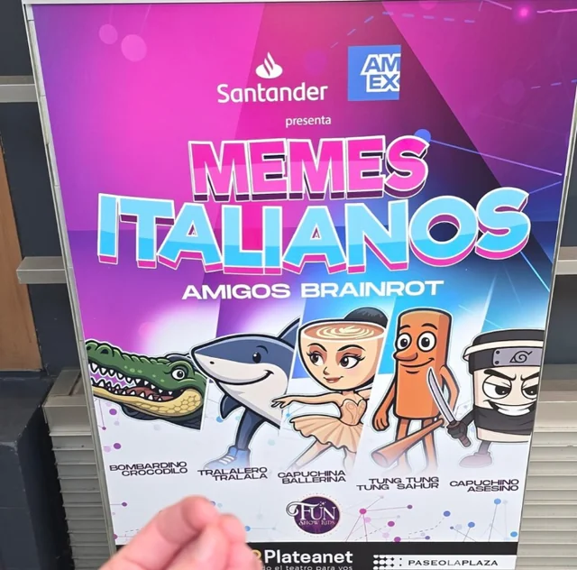

# Tocanna: a artista que as big techs gostam

Eu talvez seja criticado por tomar essa posição, MAS: não vamos normalizar lixo gerado por IA. Não vamos normalizar lixo gerado por IA. NÃO VAMOS NORMALIZAR LIXO GERADO POR IA.

### Tocanna, memes e "artistas" de IA

#### Eu vou me incomodar...

Mas alguém precisava dizer isso.

#### O que é Tocanna?

<https://g1.globo.com/inovacao/noticia/2025/09/07/tocanna-quem-e-a-cantora-feita-por-ia-do-hit-proibidao-sao-paulo.ghtml>

<https://www.terra.com.br/diversao/musica/criador-de-tocanna-ia-que-incomodou-jay-z-foca-agora-em-musica-sobre-o-rio-e-uma-satira,9f345bd26d832f2d2b368ed5777e07e7fe27zqtk.html>

#### Até o final do vídeo...

- "Mas é só um meme!"
- "O autor ainda escreve as letras"
- "É a mesma coisa que fazer versões ou paródias!"
- "Não tem nenhum dinheiro envolvido"

#### Por que isso é ruim?

- Sem muita enrolação: isso é plágio semi automatizado
  - Não credita os artistas originais (existem maneiras de fazer)
  - Está monetizado nas plataformas, competindo com artistas reais
  - Se a IA funciona como uma 'lavagem' de plágio, onde não fica óbvio imediatamente o roubo. Aqui é diretamente reconhecível
  - JAY-Z tá certo e todos outros artistas deveriam ir atrás da Tocanna e das plataformas que geraram essas músicas
- "Mas isso não é apenas uma paródia ou meme"? É sim e eu entendo o apelo e a vontade de passar pano para isso.
  - A lei de direitos autorais é uma merda que não ajuda os artistas de verdade
  - Porém fazer versões, paródias e referências é uma linha tênue do contrato social de ser um artista. E hoje a Tocanna está largando uma bela cagada do outro lado da linha
  - Sem falar nas gerações de imagem com fotos de famosos que se acontecesse comigo e eu tivesse dinheiro eu ia atrás.
- A Tocanna e paǵinas de memes estão fazendo é muito pior. Algo que produtoras, gravadoras e Spotify querem fazer há muito tempo: NORMALIZAR O CONSUMO DE SLOP GERADO POR IA

  <https://ca.news.yahoo.com/next-natalie-portman-meet-tilly-103943494.html>

  <https://g1.globo.com/pop-arte/musica/noticia/2025/07/09/the-velvet-sundown-banda-gerada-por-ia-alcanca-1-milhao-de-ouvintes-e-se-destaca-em-sao-paulo.ghtml>
- Esse é o sonho de todas as gravadoras e o resultado lógico final de IAs generativas + capitalismo
  - Artistas infinitamente reprodutíveis
  - Sem personalidade humana (não vão denunciar o genocídio em Gaza, podem vender qualquer produto sem nenhum problema ético, etc...)
  - Todo o dinheiro fica com as gravadoras/plataformas

- Eu não posso provar isso, mas parece haver uma espécie de preferência das redes sociais e plataformas por conteúdo gerado por IA. O motivo para isso existe, mas como disse, sem provas.

#### ... mas eu tenho algumas soluções

##### Solução 1

- Eu realmente to pouco me fudendo pra direitos autorais ou plágio... num mundo onde todas pessoas tem um mínimo de dignidade e acesso a condições básicas de vida
- Então, não monetize esta merda. Crie memes organicamente com uma comunidade.
- Outra opção é todo mundo monetizar ela e todas suas outras "geniais criações de design" usando ferramentas de IA para recriar infinitamente seu personagem.
  - Compartilhem nos comentários prompts de como reproduzir a Tocanna

##### Solução 2

- Pessoas que não passam pano para roubo, plágio, precarização do trabalho dos artistas podem ir em todas as plataformas onde está hospedado conteúdo da Tocanna e reportar por violação de direitos autorais
- De quebra exigir de todas as páginas de memes que parem de repostar conteúdo spam de IA. Não podemos normalizar isso.

{{#embed https://www.youtube.com/watch?v=DUlj48Rvp1c}}
