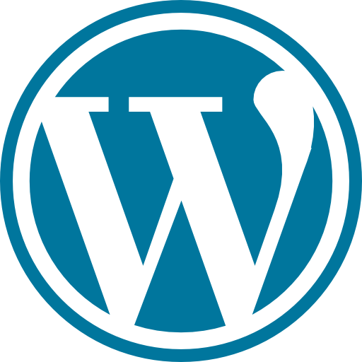
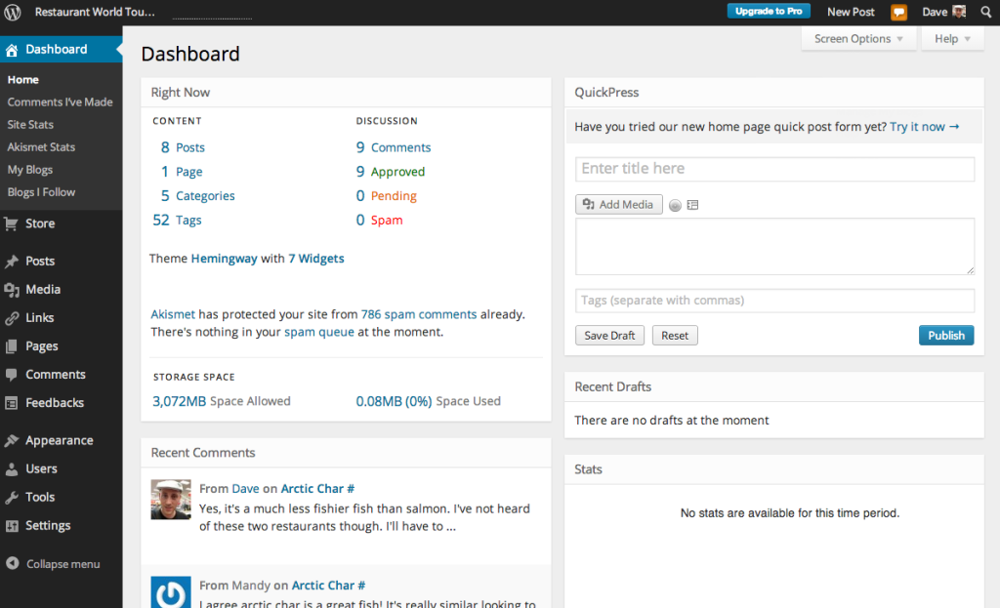

# Wordpress VS WP Engine

## Personagens

#### **Wordpress.org e fundação Wordpress**

O famoso projeto de software livre Wordpress, escrito em PHP e licenciado sob a GPLv2 e que está sob a tutela da Wordpress Foundation.

Hoje é o maior sistema de *blogging* da internet. Estima-se que entre 43.6% (dos maiores sites) e 62.5% (dos sites que divulgam seu CMS) sejam Wordpress em Outubro de 2024 (fonte: <https://w3techs.com/technologies/details/cm-wordpress>)

Por causa de uma ênfase na customização de funcionalidade por plugins e da aparência com temas ele na realidade é usado para muito mais que apenas *blogs*. Imagine sites institucionais, lojas, galerias, LMS, sites para membros.

No passado já foi muito associado a falhas de segurança, um problema que pouco a pouco foi resolvido por atualizações automáticas e centralizadas servidas por meio do Wordpress.com

#### Wordpress.com e Automattic

Wordpress.com é o braço comercial do projeto Wordpress e uma plataforma de hospedagem de Wordpress. É gerenciado pela empresa **Automattic**. Além disso é responsável por operar o repositório de atualizações, plugins e temas do Wordpress além da manutenção de alguns projetos famosos como **Jetpack**, **Askimet**, **Gravatar**. Além de sites como o **Tumblr**.

#### Matt Mullenweg

CEO da Automattic e membro do board da Wordpress Foundation. Se colocou no papel de defender os interesses do projeto aberto, porém dá pra ver que existe um conflito de interesses.

#### WP Engine e Silver Lake

Wp Engine é uma empresa de hospedagem de Wordpress, pode ser visto como análoga ao Wordpres.com. A relação entre a Automattic e a WP Engine já foi mais próxima, porém parece ter havido um distanciamento depois que ela foi comprada pelo grupo de investimentos Silver Lake. Detalhe importante é que em 2011 a própria Automattic havia investido na WP Engine e se retirou em meados de 2018 quando houve essa compra.

#### Theo e The Primeagen

Ambos são YouTubers famosos no campo de tecnologia e se envolveram um pouco com o drama pois receberam Matt nos seus respectivos canais depois de terem repercutido a situação.

### Ok, mas qual é o conflito?

- Tudo começa com Matt Mullenweg denunciando a empresa WP Engine em sua apresentação do WordCamp
  - Eles estão 'strip mining the Wordpress ecosystem'
  - Eles são um câncer na comunidade
  - Eles ganham 1.5 bilhão de dólares por ano e contribuem apenas 47 horas em desenvolvimento enquanto a Automattic que tem um tamanho similar contribui 3786
  - São controlados por uma firma de investimentos que tem 102 bilhões no seu portfolio e não se importam com o software livre
- Mais tarde em algumas postagens [no blog do Wordpress.org](https://wordpress.org/news/2024/09/wp-engine/) ele (ou o "projeto" em si) denunciam que a WP Engine se aproveita da confusão com o ecossistema Wordpress para ganhar clientes
  - Uso do termo WP e do nome Wordpress em todos seus produtos

- Isto foi seguido de processos mútuos entre a Automattic (por violação de marca registrada) e a WP Engine ('cease and desist' e depois um processo) e de muito drama dentro da comunidade além de diversas reviravoltas

### Breve linha do tempo

[Fonte (muito mais detalhada)](https://www.joeyoungblood.com/technology/timeline-of-wordpress-and-wp-engine-drama/)

- Matt entra em contato com WP Engine dizendo que vai denunciar o WP Engine na sua apresentação do WordCamp e pressionando por um acordo de marca registrada ("estratégia nuclear" segundo ele)
- Apresentação do Matt denunciando o WP Engine
- Cease and Desist do WP Engine
- Automattic responde com seu próprio Cease and Desist e ameaça os processos por violação de marca registrada
- Política de privacidade do Wordpress é atualizada citando o caso do WP Engine como um exemplo de violação
- Servidores do WP Engine são banidos de acessar os domínios do Wordpress(.org). Impedindo atualizações de código, plugins e temas
- 2 dias depois o ban é retirado e seria mais tarde colocado novamente. Porém dessa vez o WP Engine estava pronto com seu próprio sistema de atualizações
- WP Engine de fato processa a Automattic
- Matt oferece um plano de demissão voluntária para funcionários da empresa que não concordam com a opinião dele. Aparentemente 8% da empresa ou 159 pessoas decidem fazê-lo <https://www.404media.co/automattic-buyout-offer-wordpress-matt-mullenweg/?ref=daily-stories-newsletter>
- Wordpress.com adiciona uma checkbox de 'eu não tenho afiliação com a WP Engine' no seu form de login
- Wordpress.com toma o controle do plugin mais popular mantido pela WP Engine 'Advanced Custom Fields'

### Mas quem está certo?

Veja bem ...

### Entrevistas

{{#embed https://www.youtube.com/watch?v=H6F0PgMcKWM }}

{{#embed https://www.youtube.com/watch?v=OUJgahHjAKU }}
