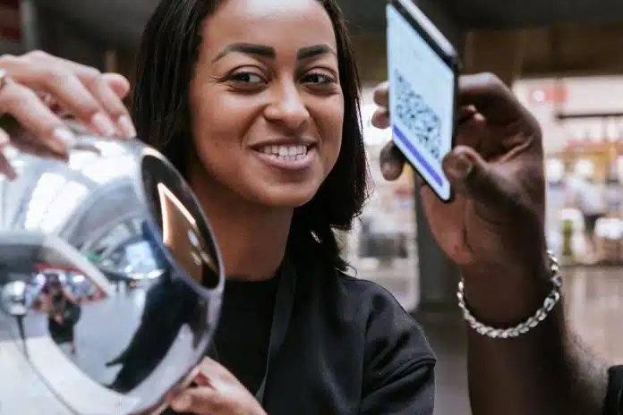

# Vendi minha íris para o Sam Altman por 0 dólares

<https://g1.globo.com/tecnologia/noticia/2025/02/13/brasileiros-pagos-para-escanear-a-iris-enfrentam-dificuldades-com-aplicativo-do-projeto-perdi-a-conta-e-o-dinheiro.ghtml>

#### **O que é a Worldcoin?**

- É um projeto da empresa **Tools for Humanity** encabeçado por Sam Altman, da OpenAI.
- Ele visa escanear a íris de pessoas para usá-la como um método de autenticação de humanidade que não poderia ser usado por 'bots'. Quem participa do escaneamento é remunerado com a criptomoeda **Worldcoin**

- O projeto tem 3 partes:
  - uma identidade única que pode ser usada globalmente
  - uma criptomoeda atrelada à essa identidade
  - um aplicativo de pagamentos e compras usando essa moeda e outros tipos de ativos
- O projeto guarda numa blockchain um 'hash' da íris de cada usuário (dizem eles de maneira anônima) e guarda as íris de uma maneira 'distribuída'

<https://www.techtarget.com/whatis/feature/Worldcoin-explained-Everything-you-need-to-know>

- Aparentemente operando em 35 paises. Uma lista de lugares pode ser explorada aqui <https://world.org/find-orb>

- 55 pontos de coleta foram abertos na periferia de São Paulo e obviamente as pessoas estão motivadas a fazerem isso pela grana e não tanto por entenderem ou serem entusiastas da tecnologia
- <https://exame.com/future-of-money/cripto-de-sam-altman-muda-hardware-e-faz-parceria-com-rappi-para-delivery-de-escaneamento-de-iris/>
- <https://oglobo.globo.com/economia/noticia/2024/04/11/em-meio-a-crise-argentinos-fazem-filas-para-escanear-a-iris-em-troca-de-criptomoedas.ghtml>
- O pagamento pelo escaneamento é 20 world tokens 1 dia depois do processo e 28 parcelado durante o ano. 20 world coins equivalia a R$ 600 no final de 2024 (nesse momento equivale a R$ 141)

- A ANPD suspendeu os pagamentos da plataforma por não existir um representante legal no Brasil e não adequação à LGPD. Isso fez a empresa cessar as atividades de coleta no Brasil.
- Diversas pessoas que participaram do processo relataram bugs e dificuldade de sacar o dinheiro e acessar sua conta. O processo de desinstalar o aplicativo causou com que muitas pessoas tenham **perdido** suas contas e os pontos de escaneamento não tem profissionais preparados para ajudar.
- A resposta da World é: vocês podem pedir ajuda pelo app, mas deveriam ter feito o backup da sua conta OOOOOOPS
- No artigo do G1 eles trazem diversos relatos de pessoas que foram lesadas e falam sobre a possibilidade de entrarem com ações contra a empresa
- Eu entrei nos comentários do G1 e tem muito moralismo e racismo lá, mas eu fiquei me perguntando:
  - Por que tanta gente se interessou pelo escaneamento de íris (fácil)
  - Como eles coordenaram essa ação em tantos pontos no Brasil?
  - O que Sam Altman ganha com isso?
  - Os problemas da biometria para autenticação
  - O papel de algo como a Worldcoin para o imperialismo dos EUA

**Me lembrou disso:**

{{#embed https://www.youtube.com/watch?v=Yo-BrASMHU4}}

**Sam Altman e sua ideia sobre UBI**

<https://moores-samaltman-com.translate.goog/?_x_tr_sl=en&_x_tr_tl=pt&_x_tr_hl=pt&_x_tr_pto=tc>
